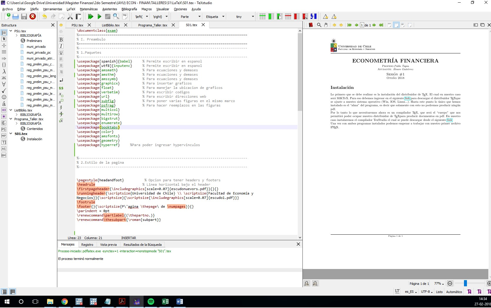
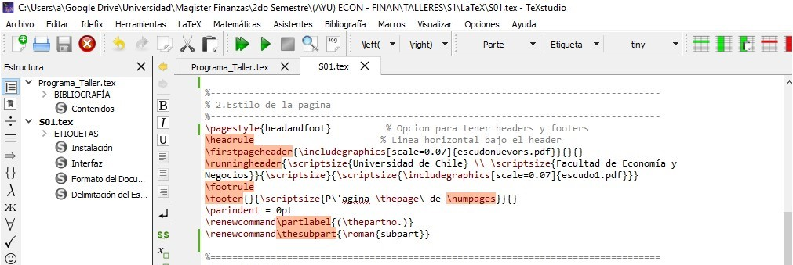
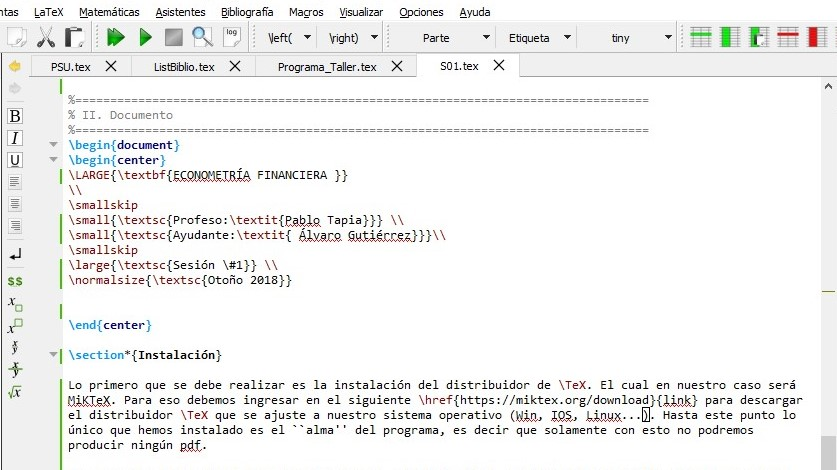

# Instalación


Lo primero que se debe realizar es la instalación del distribuidor de $\TeX$. El cual en nuestro caso será MiKTeX. Para eso debemos ingresar en el siguiente [link](https://miktex.org/download)  para descargar el distribuidor $\TeX$ que se ajuste a nuestro sistema operativo (Win, IOS, Linux...). Hasta este punto lo único que hemos instalado es el "alma"" del programa, es decir que solamente con esto no podremos producir ningún pdf. 

Por lo tanto, lo que necesitaremos ahora es un compilador $\TeX$, que será el "cuerpo" que nos permitirá poder ocupar nuestro distribuidor de $\TeX$ para producir documentos pdf. En nuestro, caso instalaremos el compilador TexStudio el cual se puede descargar desde el siguiente [link](https://www.texstudio.org/).

Una vez con ambos programas instalados podemos empezar a trabajar con nuestro primer archivo $\LaTeX$. 


#Interfaz


```{r interfaz, echo=FALSE, fig.cap="Interfaz", out.width = '550%'}

```
Lo primero en que debemos preocuparnos, antes de producir un documento en $\LaTeX$, es de nuestro "Preámbulo", lo que en la Figura \ref{interfaz} corresponde a los "usepackage". A diferencia de un editor de texto tradicional (e.g: Word), antes de empezar a escribir nuestro documento debemos pedirle que "cargue" los paquetes necesarios para lo que deseemos realizar. Por ejemplo, el primer paquete cargado corresponde a "babel, con la opción [que van entre corchetes] "spanish". Esto nos está diciendo que cargamos el paquete "babel", con la opción "spanish" que justamente es para que soporte los acentos y las ñ del idioma español. 

Así, consecutivamente se fueron agregando más paquetes necesarios para la compilación de este documento, sobres estos no entraremos en detalle por ahora, ya que a medida que se empieza a utilizar esta herramienta, y se amplía la imaginación, se van necesitando más paquetes para realizar las rutinas, pero por ahora, solo nos quedaremos con lo elemental.

Algo que vale la pena mencionar es que, a la hora de ir cargando paquetes a nuestro documento estos deberán ser instalados por el distribuidor $\TeX$, por lo que se generará una ventana emergente que nos dirá que MikTeX, está tratando de acceder a internet para instalar algo, ante esto debemos darle aceptar y esperar a que se descargue el paquete. De todos modos, esto solo ocurre la primera vez que se carga el nuevo paquete debido a que luego queda almacenado en el computador.


#Formato del Documento 

```{r formato, echo=FALSE, fig.cap="formato", out.width = '550%'}

```

Luego de definir los paquetes a utilizar, debemos preocuparnos en el formato que queremos darle a la página. En este caso, el documento cuenta con un encabezado, que posee el logo de la Universidad de Chile en la primera hoja y otro para las hojas consecutivas, así como una linea en el encabezado y en el pie de página. Todo esto de logra con lo que aparece en como punto "2. Estilo de la Página"" en la Figura (\ref{formato}). Sobre este punto podríamos discutir extensivamente, pero queda a criterio del usuario darle el formato que más le parezca a su documento, en particular creo que una página iluminadora sobre peste punto se encuentra en este [foro](https://www.sharelatex.com/learn/Headers_and_footers).


#Delimitación del Espacio de Trabajo


##Definición de un Ambiente 


 Para iniciar, debemos entender el concepto de ambiente (environment), el cual se define un espacio dentor del cual podremos realizar acciones que no están definidas fuera de este. Un ejemplo claro, en el que se profundizará más adelante, es el ambiente "equation"", el cual al ser invocado nos permitirá escribir ecuaciones dentro de este. Este funciona escribiendo lo siguiente, es invocamos el ambiente,"equation"" y escribimos en el lenguaje matemático dentro de él, para luego cerrar el ambiente cuando no lo necesitemos más.
 
 Como ejemplo. Si escribimos:
```
\begin{equation}
\sum_{i=0}^{\infty} \alpha^{i} = \frac{1}{1-\alpha}
\end{equation}
```
Obtendremos:

 \begin{equation}
 \sum_{i=0}^{\infty} \alpha^{i} = \frac{1}{1-\alpha}
\end{equation}

## Espacio de Trabajo

Ahora entendiendo lo que significa un ambiente debemos llamar al ambiente que engloba todo nuestro espacio de escritura que corresponde a:

```
\begin{document}
contenidos...
\end{document}
```

Como se puede apreciar en la Figura (\ref{fig:seccion}) en donde luego del inicio del ``begin document'', podemos escribir el titulo de la página, con el nombre del curso, el profesor, etc. Para luego iniciar nuestra primera \textbf{Secction} (Sección), lo que irá delimitando el espacio las secciones del documento.

```{r seccion, echo=FALSE, fig.cap="seccion", out.width = '199%'}

```

## Generación de listas
Algo, que vale la pena mencionar, es la forma en que se pueden generar listas anidadas para nombrar elementos, por ejemplo:

```{r list, echo=FALSE, fig.cap="list", out.width = '30%'}
knitr::include_graphics("list.jpg")
```
Se genera al escribir el código:

```
 \begin{enumerate}
	\item First level item
	\item First level item
	\begin{enumerate}
		\item Second level item
		\item Second level item
		\begin{enumerate}
			\item Third level item
			\item Third level item
			\begin{enumerate}
				\item Fourth level item
				\item Fourth level item
			\end{enumerate}
		\end{enumerate}
	\end{enumerate}
\end{enumerate}
```


#Importación de Tablas y Gráficos


Este será una de las actividades que más ocuparemos a lo largo de este taller, debido a que los insumos del documento serán generados desde STATA, por lo que solo tendremos que llamarlos con nuestro documento $\LaTeX$.

##Tablas
En el caso de las Tablas, lo más común, será utilizar el comando "input", para llamar directamente a la tabla que deberemos tener almacenada en la misma carpeta donde tenemos guardado el tex principal.


De este modo, al tener guardado el código de nuestra tabla con el nombre "tabla\_ejemplo.tex", podremos invocarla con la siguiente linea de comandos.

```
\begin{table}
\centering
\caption{Price cars \label{cars}}
\input{tabla_ejemplo}
\end{table}
```

En donde lo que está almacenado en tabla\_ejemplo es: 
```
\begin{tabular}{lccc} \hline
	& (1) & (2) & (3) \\
	& model1 & model2 & model3 \\
	VARIABLES & Price & Price & Price \\ \hline
	&  &  &  \\
	Mileage (mpg) & -238.9*** & -294.2*** & -262.0*** \\
	& (53.08) & (55.69) & (64.91) \\
	Car type &  & 1,767** & 1,887*** \\
	&  & (700.2) & (711.4) \\
	Trunk space (cu. ft.) &  &  & 83.65 \\
	&  &  & (86.50) \\
	Constant & 11,253*** & 11,905*** & 10,033*** \\
	& (1,171) & (1,159) & (2,257) \\
	&  &  &  \\
	Observations & 74 & 74 & 74 \\
	R-squared & 0.220 & 0.284 & 0.293 \\ \hline
	\multicolumn{4}{c}{ Standard errors in parentheses} \\
	\multicolumn{4}{c}{ *** p$<$0.01, ** p$<$0.05, * p$<$0.1} \\
\end{tabular}
```


Lo que finalmentre producirá la Tabla será:
```
\begin{table}[h!]
	\centering
	\caption{Price cars \label{cars}}
	\scalebox{.7}{
	\input{tabla_ejemplo}}
\end{table}
```
Con lo que finalmente obtendremos:


```{r table_cars, echo=FALSE, fig.cap="seccion", out.width = '45%'}
knitr::include_graphics("table_cars.jpg")
```

##Graficos 

Para importar gráficos es bastante similar, solamente debemos cambiar el ambiente. Por ejemplo, para importar la primera imagen de este documento en la que se muestra la interfaz \ref{interfaz}, se utilizó el ambiente "figure" para llamar al archivo "interfaz.jpg" de la siguiente forma:


```
\begin{figure}[h!]
	\centering
	\includegraphics[width=0.9\linewidth]{interfaz}
	\caption{Interfaz}
	\label{fig:interfaz}
\end{figure}
```


# Editor de Ecuaciones

Dentro de esto existe una infinidad de ambientes diferentes, acá haré un listado meramente ejemplificador sin ánimos de abarcar la inmensa cantidad de paquetes disponibles.

##equation
Es el más tradicional de los formatos y consiste en:
```
\begin{equation}
p(x) = 3x^6 + 14x^5y + 590x^4y^2 + 19x^3y^3- 12x^2y^4 - 12xy^5 + 2y^6 - a^3b^3
\end{equation}
```
Produciendo:
\begin{equation}
p(x) = 3x^6 + 14x^5y + 590x^4y^2 + 19x^3y^3- 12x^2y^4 - 12xy^5 + 2y^6 - a^3b^3
\end{equation}


##multline

```
\begin{multline*}
p(x) = 3x^6 + 14x^5y + 590x^4y^2 + 19x^3y^3\\
 - 12x^2y^4 - 12xy^5 + 2y^6 - a^3b^3
\end{multline*}
```
\begin{multline*}
p(x) = 3x^6 + 14x^5y + 590x^4y^2 + 19x^3y^3\\
 - 12x^2y^4 - 12xy^5 + 2y^6 - a^3b^3
\end{multline*}


##align

```
\begin{align*} 
2x - 5y &=  8 \\ 
3x + 9y &=  -12
\end{align*}
```

\begin{align*} 
2x - 5y &=  8 \\ 
3x + 9y &=  -12
\end{align*}


##Miselanea 1


```
\begin{equation}
L(\theta_1,\theta_2) = \left\lbrace
\begin{array}{ll}
\frac{1}{(\theta_2 -  \theta_1)^{N}} &  \text{if } 
\theta_1 \leq min \left \lbrace  x_i \right \rbrace_{i=1}^{N} \leq max \left \lbrace  x_i \right \rbrace_{i=1}^{N} \leq \theta_2


\\
0\ & \text{Otherwise } 
\end{array}
\right.
\end{equation}
```

\begin{equation}
L(\theta_1,\theta_2) = \left\lbrace
\begin{array}{ll}
\frac{1}{(\theta_2 -  \theta_1)^{N}} &  \text{if } 
\theta_1 \leq min \left \lbrace  x_i \right \rbrace_{i=1}^{N} \leq max \left \lbrace  x_i \right \rbrace_{i=1}^{N} \leq \theta_2


\\
0\ & \text{Otherwise } 
\end{array}
\right.
\end{equation}


##Miselanea 2


```
\begin{equation}\label{asintotica_mco}
 \hat{\beta}_{MCO}  \xrightarrow[]{d} N \left(\;\;\;  \beta \;\;\; , \frac{\sigma^{2}}{N}   Q^{-1} \left(  Plim \left(  \frac{X'\Omega X}{N}  \right)   \right)   Q^{-1}   \right)
\end{equation}
```

\begin{equation}\label{asintotica_mco}
 \hat{\beta}_{MCO}  \xrightarrow[]{d} N \left(\;\;\;  \beta \;\;\; , \frac{\sigma^{2}}{N}   Q^{-1} \left(  Plim \left(  \frac{X'\Omega X}{N}  \right)   \right)   Q^{-1}   \right)
\end{equation}


Para mayor discusión sobre el tema, les dejo acá un [link](https://www.sharelatex.com/learn/Mathematical_expressions)  que contiene mucho material sobre ecuaciones de latex. 


